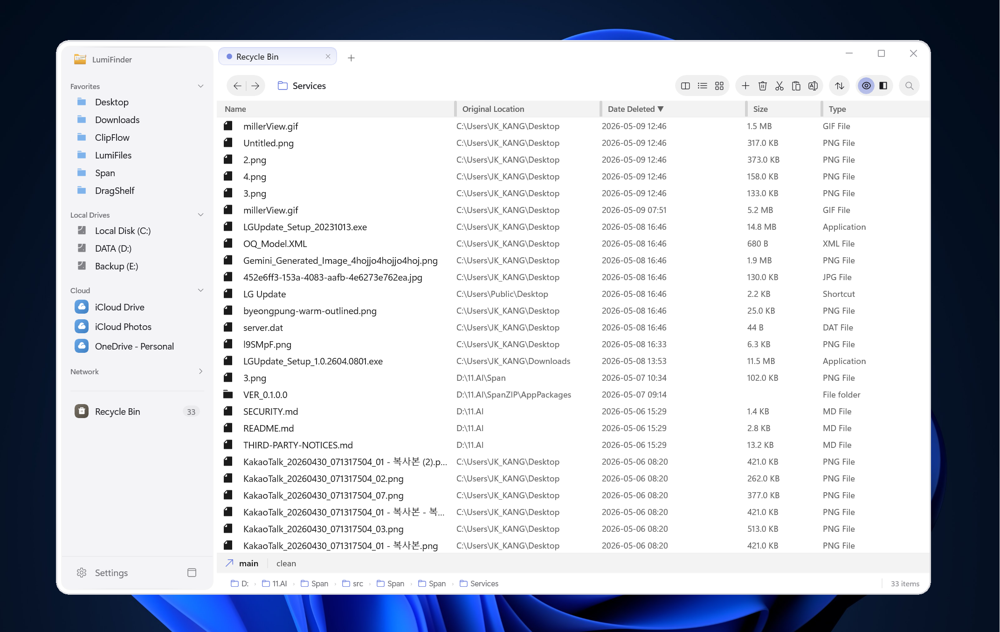

<h1 align="center">
  LumiFinder
</h1>

<p align="center">
  <strong>Les colonnes Miller du Finder de macOS, réimaginées pour Windows.</strong><br>
  Pour les utilisateurs avancés qui sont passés à Windows mais qui n'ont jamais cessé de regretter la vue en colonnes.
</p>

<p align="center">
  <a href="https://github.com/LumiBearStudio/LumiFinder/releases/latest"></a>
  <a href="../LICENSE"></a>
  <a href="https://github.com/sponsors/LumiBearStudio"></a>
</p>

<p align="center">
  <a href="../README.md">English</a> |
  <a href="README.ko.md">한국어</a> |
  <a href="README.ja.md">日本語</a> |
  <a href="README.zh-CN.md">简体中文</a> |
  <a href="README.zh-TW.md">繁體中文</a> |
  <a href="README.de.md">Deutsch</a> |
  <a href="README.es.md">Español</a> |
  <strong>Français</strong> |
  <a href="README.pt.md">Português</a>
</p>

---


> **Naviguez les hiérarchies de dossiers comme elles devraient l'être.**
> Cliquez sur un dossier, son contenu apparaît dans la colonne suivante. Vous voyez toujours où vous êtes, d'où vous venez et où vous allez — tout en même temps. Plus besoin de cliquer en avant et en arrière.


<p align="center">
  <a href="https://github.com/LumiBearStudio/LumiFinder/stargazers"></a>
</p>
<p align="center">
  Si LumiFinder vous est utile, pensez à lui donner une ⭐ — cela aide les autres à découvrir ce projet !
</p>

---

## Pourquoi LumiFinder ?

| | Explorateur Windows | LumiFinder |
|---|---|---|
| **Colonnes Miller** | Non | Oui — navigation hiérarchique multi-colonnes |
| **Multi-onglet** | Windows 11 uniquement (basique) | Onglets complets avec détachement, ré-ancrage, duplication, restauration de session |
| **Vue partagée** | Non | Double panneau avec modes de vue indépendants |
| **Panneau d'aperçu** | Basique | Plus de 10 types de fichiers — images, vidéo, audio, code, hex, polices, PDF |
| **Navigation au clavier** | Limitée | Plus de 30 raccourcis, recherche type-ahead, conception clavier-d'abord |
| **Renommage en lot** | Non | Regex, préfixe/suffixe, numérotation séquentielle |
| **Annuler/Rétablir** | Limité | Historique complet des opérations (profondeur configurable) |
| **Couleur d'accent personnalisée** | Non | 10 couleurs prédéfinies + thème clair/sombre/système |
| **Densité de mise en page** | Non | 6 niveaux de hauteur de ligne + échelle police/icône indépendante |
| **Connexions distantes** | Non | FTP, FTPS, SFTP avec identifiants enregistrés |
| **Espaces de travail** | Non | Sauvegarder et restaurer instantanément des dispositions d'onglets nommées |
| **Étagère de fichiers** | Non | Zone de transit glisser-déposer style Yoink |
| **État du cloud** | Superposition basique | Badges de synchronisation en temps réel (OneDrive, iCloud, Dropbox) |
| **Vitesse de démarrage** | Lent sur grands répertoires | Chargement asynchrone avec annulation — pas de retard |

---

## Fonctionnalités

### Colonnes Miller — Voir tout d'un coup d'œil

Naviguez les hiérarchies de dossiers profondes sans perdre le contexte. Chaque colonne représente un niveau — cliquez sur un dossier et son contenu apparaît dans la colonne suivante. Vous voyez toujours où vous êtes et d'où vous venez.

- Séparateurs de colonnes glissables pour des largeurs personnalisées
- Auto-égalisation des colonnes (Ctrl+Maj+=) ou auto-ajustement au contenu (Ctrl+Maj+-)
- Défilement horizontal fluide qui garde la colonne active visible
- Mise en page stable — pas de tremblement de défilement lors de la navigation au clavier ↑/↓

### Quatre modes de vue

- **Colonnes Miller** (Ctrl+1) — Navigation hiérarchique, la signature de LumiFinder
- **Détails** (Ctrl+2) — Tableau triable avec nom, date, type, taille
- **Liste** (Ctrl+3) — Mise en page multi-colonnes dense pour scanner de grands répertoires
- **Icônes** (Ctrl+4) — Vue en grille avec 4 tailles jusqu'à 256×256



### Multi-onglet avec restauration complète de session

- Onglets illimités, chacun avec son propre chemin, mode de vue et historique
- **Détachement et ré-ancrage d'onglets** : Faites glisser un onglet pour créer une nouvelle fenêtre, glissez-le de retour pour l'ancrer — indicateur fantôme style Chrome et retour visuel de fenêtre semi-transparent
- **Duplication d'onglet** : Clonez un onglet avec son chemin et ses paramètres exacts
- Sauvegarde automatique de session : Fermez l'app, rouvrez-la — chaque onglet exactement où vous l'avez laissé

### Vue partagée — Vrai double panneau


- Navigation côte à côte avec navigation indépendante par panneau
- Chaque panneau peut utiliser un mode de vue différent (Miller à gauche, Détails à droite)
- Panneaux d'aperçu séparés pour chaque panneau
- Glissez des fichiers entre panneaux pour copier/déplacer

### Panneau d'aperçu — Sachez avant d'ouvrir

Appuyez sur **Espace** pour Quick Look (style Finder de macOS) :

- **Navigation par flèches et Espace** : Parcourez les fichiers sans fermer Quick Look
- **Persistance de la taille de fenêtre** : Quick Look se souvient de sa dernière taille
- **Images** : JPEG, PNG, GIF, BMP, WebP, TIFF avec résolution et métadonnées
- **Vidéo** : MP4, MKV, AVI, MOV, WEBM avec contrôles de lecture
- **Audio** : MP3, AAC, M4A avec artiste, album, durée
- **Texte et code** : Plus de 30 extensions avec affichage de syntaxe
- **PDF** : Aperçu de la première page
- **Polices** : Échantillons de glyphes avec métadonnées
- **Binaire hexadécimal** : Vue d'octets bruts pour développeurs
- **Dossiers** : Taille, nombre d'éléments, date de création
- **Hash de fichier** : Affichage somme SHA256 avec copie en un clic (activable dans Paramètres)

### Conception clavier-d'abord

Plus de 30 raccourcis clavier pour les utilisateurs qui gardent leurs mains au clavier :

| Raccourci | Action |
|----------|--------|
| Flèches | Naviguer colonnes et éléments |
| Entrée | Ouvrir dossier ou exécuter fichier |
| Espace | Basculer panneau d'aperçu |
| Ctrl+L / Alt+D | Modifier barre d'adresse |
| Ctrl+F | Rechercher |
| Ctrl+C / X / V | Copier / Couper / Coller |
| Ctrl+Z / Y | Annuler / Rétablir |
| Ctrl+Maj+N | Nouveau dossier |
| F2 | Renommer (renommage en lot si multi-sélection) |
| Ctrl+T / W | Nouvel onglet / Fermer onglet |
| Ctrl+Tab / Ctrl+Maj+Tab | Cycler les onglets |
| Ctrl+1-4 | Changer mode de vue |
| Ctrl+Maj+E | Basculer vue partagée |
| F6 | Changer panneau de vue partagée |
| Ctrl+Maj+S | Enregistrer espace de travail |
| Ctrl+Maj+W | Ouvrir palette d'espaces de travail |
| Ctrl+Maj+H | Basculer extensions de fichier |
| Maj+F10 | Menu contextuel shell natif complet |
| Suppr | Déplacer vers la corbeille |

### Thèmes et personnalisation


- Suivi du thème **Clair / Sombre / Système**
- **10 couleurs d'accent prédéfinies** — remplacez l'accent de n'importe quel thème en un clic (Lumi Gold par défaut)
- **6 niveaux de densité de mise en page** — XS / S / M / L / XL / XXL hauteurs de ligne
- **Échelle police/icône indépendante** — séparée de la densité de ligne
- **9 langues** : anglais, coréen, japonais, chinois (simplifié/traditionnel), allemand, espagnol, français, portugais (BR)

### Paramètres généraux


- **Comportement de démarrage par panneau** — Ouvrir lecteur système / Restaurer dernière session / Chemin personnalisé, gauche et droite indépendamment
- **Mode de vue de démarrage** — choisissez Colonnes Miller / Détails / Liste / Icônes par panneau
- **Panneau d'aperçu** — activer au démarrage ou basculer à la demande avec Espace
- **Étagère de fichiers** — étagère de transit style Yoink optionnelle, avec persistance optionnelle entre sessions
- **Barre d'état système** — minimiser dans la barre au lieu de fermer

### Outils pour développeurs

- **Badges d'état Git** : Modified, Added, Deleted, Untracked par fichier
- **Visionneuse hex dump** : Premiers 512 octets en hex + ASCII
- **Intégration terminal** : Ctrl+` ouvre le terminal au chemin actuel
- **Connexions distantes** : FTP/FTPS/SFTP avec stockage chiffré des identifiants

### Intégration stockage cloud

- **Badges d'état de synchronisation** : Cloud uniquement, Synchronisé, Téléchargement en attente, En synchronisation
- **OneDrive, iCloud, Dropbox** détectés automatiquement
- **Vignettes intelligentes** : Utilise les aperçus en cache — ne déclenche jamais de téléchargements involontaires

### Recherche intelligente

- **Requêtes structurées** : `type:image`, `size:>100MB`, `date:today`, `ext:.pdf`
- **Type-ahead** : Commencez à taper dans n'importe quelle colonne pour filtrer instantanément
- **Traitement en arrière-plan** : La recherche ne fige jamais l'UI

### Espace de travail — Enregistrer et restaurer dispositions d'onglets

- **Enregistrer onglets actuels** : Clic droit sur un onglet → "Enregistrer disposition d'onglets..." ou Ctrl+Maj+S
- **Restaurer instantanément** : Cliquez sur le bouton espace de travail dans la barre latérale ou Ctrl+Maj+W
- **Gérer espaces de travail** : Restaurer, renommer ou supprimer dispositions enregistrées depuis le menu d'espaces de travail
- Parfait pour basculer entre contextes de travail — "Développement", "Édition photo", "Documents"

### Étagère de fichiers

- Zone de transit glisser-déposer style Yoink de macOS
- Glissez des fichiers dans l'Étagère pendant que vous naviguez, déposez-les où vous voulez
- Supprimer un élément de l'Étagère ne supprime que la référence — votre fichier original n'est jamais touché
- Désactivée par défaut — activez-la dans **Paramètres > Général > Mémoriser éléments de l'Étagère**

---

## Performances

Conçu pour la vitesse. Testé avec plus de 10 000 éléments par dossier.

- E/S asynchrones partout — rien ne bloque le thread UI
- Mises à jour de propriétés en lot avec frais minimes
- Sélection avec debounce empêche le travail redondant pendant la navigation rapide
- Cache par onglet — basculement instantané d'onglets, sans re-rendu
- Chargement concurrent de vignettes avec limitation SemaphoreSlim

---

## Configuration système requise

| | |
|---|---|
| **OS** | Windows 10 version 1903+ / Windows 11 |
| **Architecture** | x64, ARM64 |
| **Runtime** | Windows App SDK 1.8 (.NET 8) |
| **Recommandé** | Windows 11 pour fond Mica |

---

## Compiler depuis les sources

```bash
# Prérequis : Visual Studio 2022 avec charges de travail .NET Desktop + WinUI 3

# Cloner
git clone https://github.com/LumiBearStudio/LumiFinder.git
cd LumiFinder

# Compiler
dotnet build src/LumiFiles/LumiFiles/LumiFiles.csproj -p:Platform=x64

# Exécuter tests unitaires
dotnet test src/LumiFiles/LumiFiles.Tests/LumiFiles.Tests.csproj -p:Platform=x64
```

> **Note** : Les apps WinUI 3 ne peuvent pas être lancées via `dotnet run`. Utilisez **Visual Studio F5** (empaquetage MSIX requis).

---

## Contribuer

Vous avez trouvé un bug ? Vous avez une demande de fonctionnalité ? [Ouvrez une issue](https://github.com/LumiBearStudio/LumiFinder/issues) — tous les retours sont les bienvenus.

Voir [CONTRIBUTING.md](../CONTRIBUTING.md) pour la configuration de compilation, les conventions de code et les directives PR.

---

## Soutenir le projet

Si LumiFinder améliore votre gestion de fichiers, considérez :

- **[Parrainer sur GitHub](https://github.com/sponsors/LumiBearStudio)** — offrez-moi un café, un hamburger ou un steak
- **Donnez une ⭐ à ce dépôt** pour aider les autres à le découvrir
- **Partagez** avec les collègues qui regrettent le Finder de macOS sur Windows
- **Signalez les bugs** — chaque issue rend LumiFinder plus stable

---

## Confidentialité et télémétrie

LumiFinder utilise [Sentry](https://sentry.io) **uniquement pour les rapports de plantage** — et vous pouvez le désactiver.

- **Ce que nous collectons** : Type d'exception, stack trace, version OS, version app
- **Ce que nous NE collectons PAS** : Noms de fichiers, chemins de dossiers, historique de navigation, informations personnelles
- **Pas d'analyse d'usage, pas de tracking, pas de publicités**
- Tous les chemins de fichiers dans les rapports de plantage sont automatiquement nettoyés avant envoi
- `SendDefaultPii = false` — pas d'adresses IP ni d'identifiants utilisateur
- **Désactivation** : Paramètres > Avancé > Bouton "Rapports de plantage" pour désactiver complètement
- Code source ouvert — vérifiez vous-même dans [`CrashReportingService.cs`](../src/LumiFiles/LumiFiles/Services/CrashReportingService.cs)

Voir la [Politique de confidentialité](../PRIVACY.md) pour les détails complets.

---

## Licence

Ce projet est sous licence [GNU General Public License v3.0](../LICENSE).

**Marque** : Le nom "LumiFinder" et le logo officiel sont des marques déposées de LumiBear Studio. Les forks doivent utiliser un nom et un logo différents. Voir [LICENSE.md](../LICENSE.md) pour la politique complète des marques.

---

<p align="center">
  <a href="https://github.com/sponsors/LumiBearStudio">Parrainer</a> ·
  <a href="../PRIVACY.md">Politique de confidentialité</a> ·
  <a href="../OpenSourceLicenses.md">Licences open source</a> ·
  <a href="https://github.com/LumiBearStudio/LumiFinder/issues">Rapports de bugs et demandes de fonctionnalités</a>
</p>
