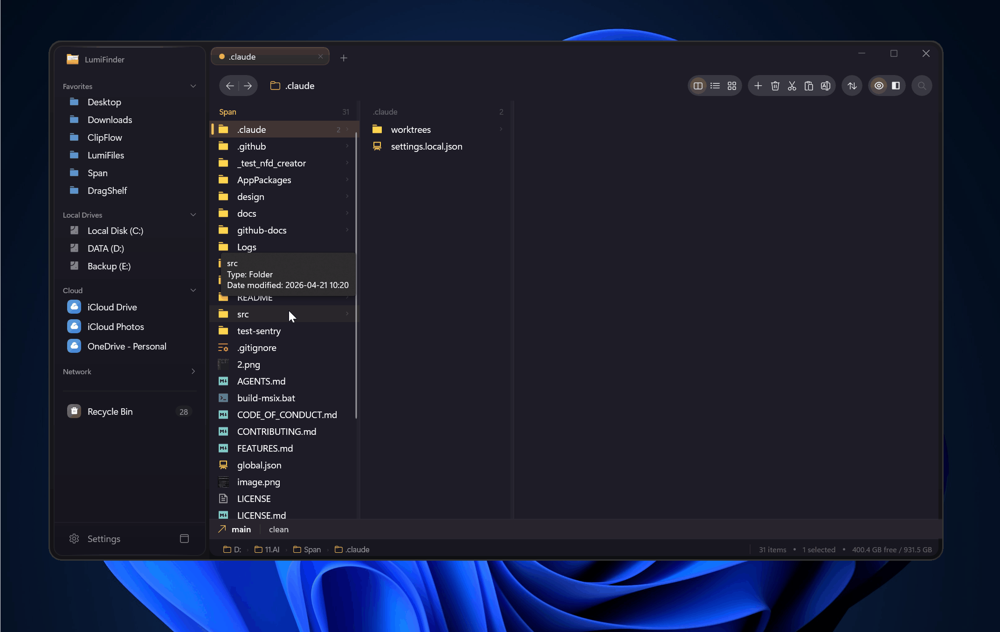
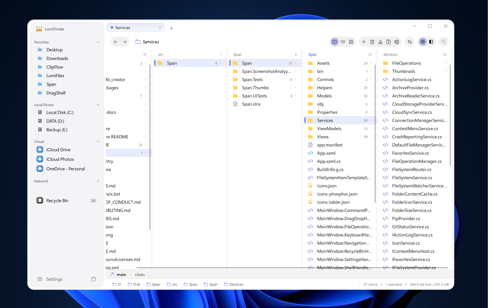
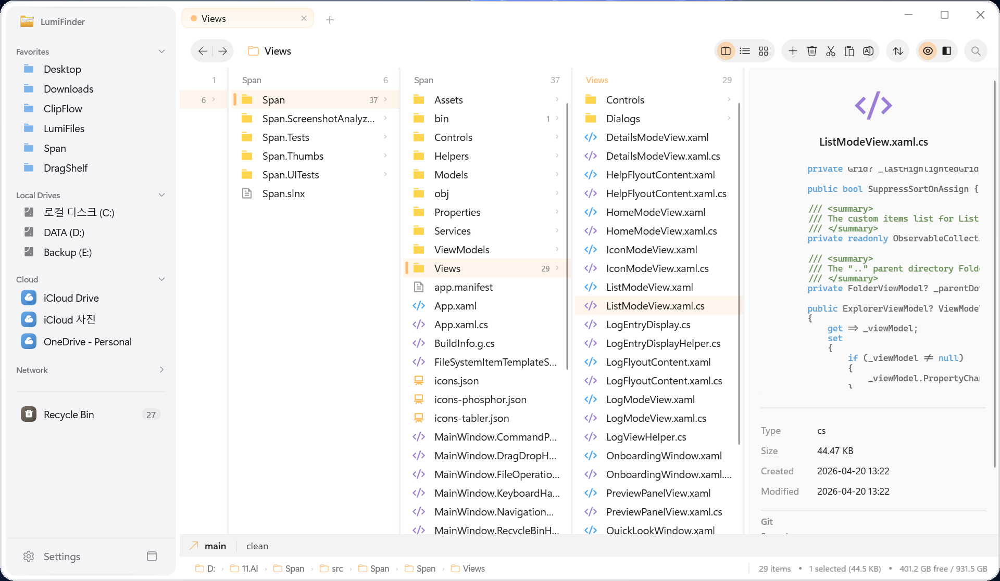
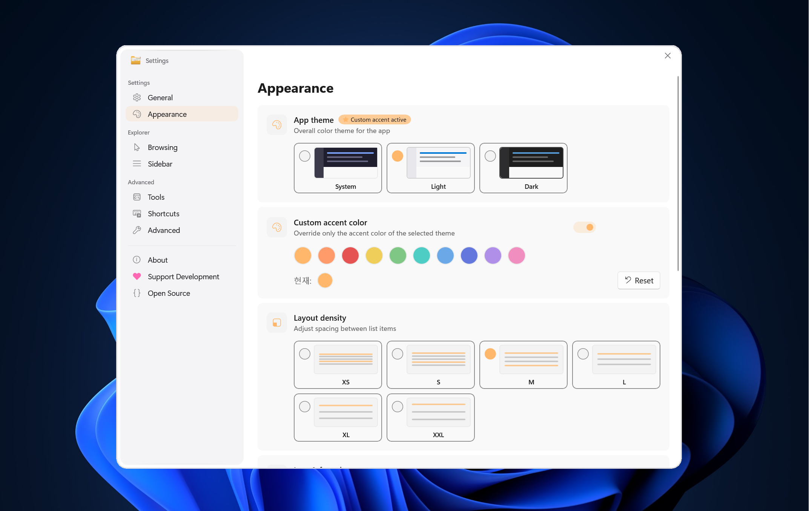
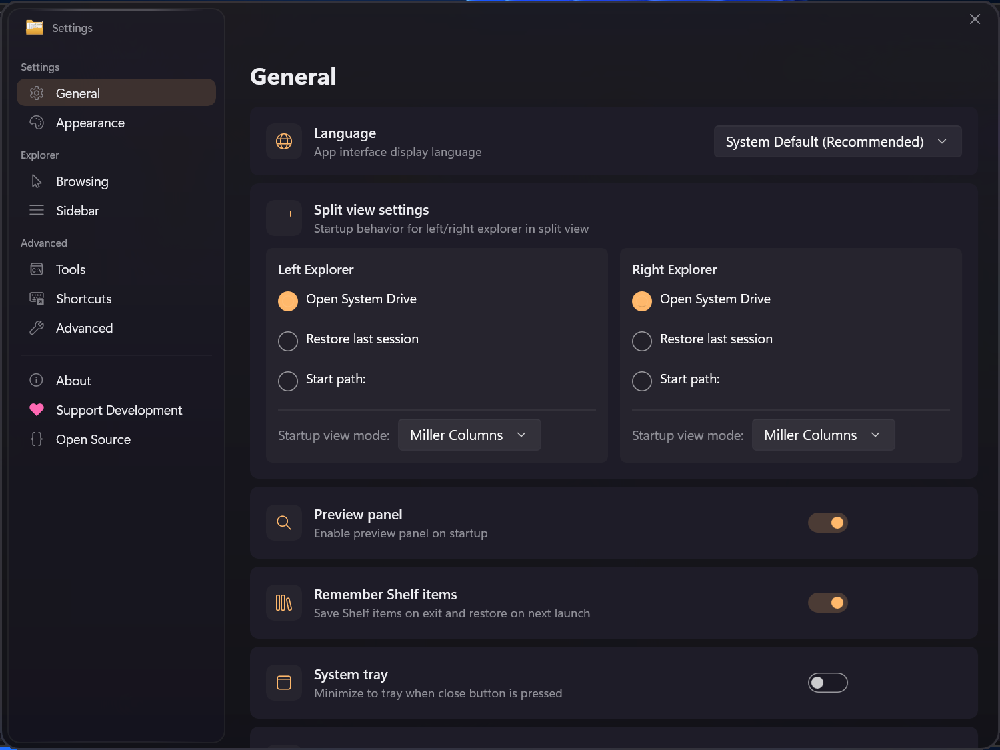

<h1 align="center">
  LumiFinder
</h1>

<p align="center">
  <strong>macOS Finder의 밀러 컬럼, Windows 에 다시 그리다.</strong><br>
  Windows 로 옮겨왔지만 컬럼 뷰를 잊지 못한 파워 유저를 위한 파일 탐색기.
</p>

<p align="center">
  <a href="https://github.com/LumiBearStudio/LumiFinder/releases/latest"></a>
  <a href="../LICENSE"></a>
  <a href="https://github.com/sponsors/LumiBearStudio"></a>
</p>

<p align="center">
  <a href="../README.md">English</a> |
  <strong>한국어</strong> |
  <a href="README.ja.md">日本語</a> |
  <a href="README.zh-CN.md">简体中文</a> |
  <a href="README.zh-TW.md">繁體中文</a> |
  <a href="README.de.md">Deutsch</a> |
  <a href="README.es.md">Español</a> |
  <a href="README.fr.md">Français</a> |
  <a href="README.pt.md">Português</a>
</p>

---



> **폴더 계층을 원래 의도된 방식대로 탐색하세요.**
> 폴더를 클릭하면 그 내용이 다음 컬럼에 펼쳐집니다. 어디 있고, 어디서 왔으며, 어디로 가는지 — 한눈에. 더 이상 뒤로/앞으로 클릭할 필요 없습니다.



<p align="center">
  <a href="https://github.com/LumiBearStudio/LumiFinder/stargazers"></a>
</p>
<p align="center">
  LumiFinder가 유용하다면 ⭐를 눌러주세요 — 다른 사람들이 이 프로젝트를 발견하는 데 큰 도움이 됩니다!
</p>

---

## 왜 LumiFinder인가?

| | Windows 탐색기 | LumiFinder |
|---|---|---|
| **밀러 컬럼** | 없음 | 계층형 다중 컬럼 탐색 |
| **다중 탭** | Windows 11 한정 (기본 기능) | 탭 분리/재도킹/복제/세션 복원 풀 지원 |
| **분할 보기** | 없음 | 좌/우 독립 뷰 모드의 듀얼 패널 |
| **미리보기 패널** | 기본 | 10여 종 파일 — 이미지, 비디오, 오디오, 코드, 헥스, 폰트, PDF |
| **키보드 탐색** | 제한적 | 30+ 단축키, 타입어헤드 검색, 키보드 우선 설계 |
| **일괄 이름 변경** | 없음 | 정규식, 접두/접미사, 순차 번호 |
| **실행 취소/다시 실행** | 제한적 | 전체 작업 히스토리 (깊이 설정 가능) |
| **사용자 액센트** | 없음 | 10가지 프리셋 + 라이트/다크/시스템 테마 |
| **레이아웃 밀도** | 없음 | 6단계 행 높이 + 폰트/아이콘 독립 스케일 |
| **원격 연결** | 없음 | FTP, FTPS, SFTP — 자격 증명 저장 |
| **워크스페이스** | 없음 | 명명된 탭 레이아웃 즉시 저장/복원 |
| **파일 셸프** | 없음 | Yoink 스타일 드래그 앤 드롭 임시 보관함 |
| **클라우드 상태** | 기본 오버레이 | 실시간 동기화 뱃지 (OneDrive, iCloud, Dropbox) |
| **시작 속도** | 큰 폴더에서 느림 | 취소 가능한 비동기 로딩 — 지연 0 |

---

## 주요 기능

### 밀러 컬럼 — 모든 것을 한눈에

깊은 폴더 계층을 컨텍스트를 잃지 않고 탐색하세요. 각 컬럼이 한 단계를 표현합니다 — 폴더를 클릭하면 그 내용이 다음 컬럼에 펼쳐집니다. 현재 위치와 거쳐온 경로를 항상 볼 수 있습니다.

- 컬럼 구분선 드래그로 너비 조정
- 자동 균등화 (Ctrl+Shift+=) 또는 컨텐츠에 자동 맞춤 (Ctrl+Shift+-)
- 활성 컬럼이 항상 보이도록 부드러운 가로 스크롤
- 안정된 레이아웃 — 키보드 ↑/↓ 탐색 시 스크롤 흔들림 없음

### 4가지 뷰 모드

- **밀러 컬럼** (Ctrl+1) — 계층형 탐색, LumiFinder의 시그니처
- **세부 정보** (Ctrl+2) — 이름/날짜/유형/크기 정렬 가능 테이블
- **목록** (Ctrl+3) — 큰 디렉터리 스캔용 고밀도 다중 컬럼 레이아웃
- **아이콘** (Ctrl+4) — 256×256까지 4단계 크기의 그리드 뷰

### 다중 탭 + 세션 자동 복원

- 무제한 탭 — 각 탭은 자체 경로/뷰 모드/히스토리
- **탭 분리/재도킹**: 탭을 끌어 새 창 만들거나 다시 도킹 — Chrome 스타일 고스트 인디케이터, 반투명 윈도우 피드백
- **탭 복제**: 정확한 경로/설정으로 탭 복제
- 세션 자동 저장: 앱 닫고 다시 열어도 모든 탭이 그대로

### 분할 보기 — 진정한 듀얼 패널



- 패널별 독립 탐색의 좌우 파일 브라우징
- 패널마다 다른 뷰 모드 (왼쪽 밀러, 오른쪽 세부 정보)
- 패널마다 별도 미리보기 패널
- 패널 간 파일 드래그로 복사/이동

### 미리보기 패널 — 열기 전에 확인

**스페이스**로 Quick Look (macOS Finder 스타일):

- **방향키 + 스페이스 탐색**: Quick Look을 닫지 않고 파일 둘러보기
- **창 크기 기억**: 마지막 크기 유지
- **이미지**: JPEG, PNG, GIF, BMP, WebP, TIFF — 해상도/메타데이터
- **비디오**: MP4, MKV, AVI, MOV, WEBM — 재생 컨트롤
- **오디오**: MP3, AAC, M4A — 아티스트/앨범/길이
- **텍스트 + 코드**: 30+ 확장자, 구문 표시
- **PDF**: 첫 페이지 미리보기
- **폰트**: 글리프 샘플 + 메타데이터
- **헥스 바이너리**: 개발자용 원시 바이트 뷰
- **폴더**: 크기/항목 수/생성일
- **파일 해시**: SHA256 체크섬 + 한 번 클릭 복사 (설정에서 활성화)

### 키보드 우선 설계

손을 키보드에서 떼지 않는 사용자를 위한 30+ 단축키:

| 단축키 | 동작 |
|----------|--------|
| 방향키 | 컬럼/항목 탐색 |
| Enter | 폴더 열기 / 파일 실행 |
| Space | 미리보기 패널 토글 |
| Ctrl+L / Alt+D | 주소 표시줄 편집 |
| Ctrl+F | 검색 |
| Ctrl+C / X / V | 복사 / 잘라내기 / 붙여넣기 |
| Ctrl+Z / Y | 실행 취소 / 다시 실행 |
| Ctrl+Shift+N | 새 폴더 |
| F2 | 이름 변경 (다중 선택 시 일괄 변경) |
| Ctrl+T / W | 새 탭 / 탭 닫기 |
| Ctrl+Tab / Ctrl+Shift+Tab | 탭 순환 |
| Ctrl+1-4 | 뷰 모드 전환 |
| Ctrl+Shift+E | 분할 보기 토글 |
| F6 | 분할 보기 패널 전환 |
| Ctrl+Shift+S | 워크스페이스 저장 |
| Ctrl+Shift+W | 워크스페이스 팔레트 |
| Ctrl+Shift+H | 파일 확장자 표시 토글 |
| Shift+F10 | 전체 네이티브 셸 컨텍스트 메뉴 |
| Delete | 휴지통으로 이동 |

### 테마 + 사용자 정의



- **라이트 / 다크 / 시스템** 테마 추적
- **10가지 프리셋 액센트** — 한 번의 클릭으로 모든 테마의 액센트 색 변경 (Lumi Gold 기본)
- **6단계 레이아웃 밀도** — XS / S / M / L / XL / XXL 행 높이
- **폰트/아이콘 독립 스케일** — 행 밀도와 분리
- **9개 언어**: 영어, 한국어, 일본어, 중국어 (간체/번체), 독일어, 스페인어, 프랑스어, 포르투갈어 (BR)

### 일반 설정



- **패널별 시작 동작** — 시스템 드라이브 열기 / 마지막 세션 복원 / 사용자 경로, 좌우 독립 설정
- **시작 시 뷰 모드** — 패널마다 밀러 컬럼 / 세부 정보 / 목록 / 아이콘 선택
- **미리보기 패널** — 시작 시 활성화 또는 스페이스로 토글
- **파일 셸프** — Yoink 스타일 임시 보관함 (옵션, 세션 간 유지 가능)
- **시스템 트레이** — 닫기 버튼으로 트레이 최소화

### 개발자 도구

- **Git 상태 뱃지**: 파일별 Modified, Added, Deleted, Untracked
- **헥스 덤프 뷰어**: 처음 512 바이트를 헥스 + ASCII로 표시
- **터미널 통합**: Ctrl+` 로 현재 경로에서 터미널 열기
- **원격 연결**: 암호화된 자격 증명 저장의 FTP/FTPS/SFTP

### 클라우드 스토리지 통합

- **동기화 상태 뱃지**: 클라우드 전용, 동기화됨, 업로드 대기, 동기화 중
- **OneDrive, iCloud, Dropbox** 자동 인식
- **스마트 썸네일**: 캐시된 미리보기 사용 — 의도하지 않은 다운로드 방지

### 스마트 검색

- **구조화 쿼리**: `type:image`, `size:>100MB`, `date:today`, `ext:.pdf`
- **타입어헤드**: 어떤 컬럼에서든 입력 시작 시 즉시 필터
- **백그라운드 처리**: 검색이 UI를 멈추는 일 없음

### 워크스페이스 — 탭 레이아웃 저장/복원

- **현재 탭 저장**: 탭 우클릭 → "탭 레이아웃 저장..." 또는 Ctrl+Shift+S
- **즉시 복원**: 사이드바의 워크스페이스 버튼 또는 Ctrl+Shift+W
- **워크스페이스 관리**: 저장된 레이아웃 복원/이름 변경/삭제
- 작업 컨텍스트 전환에 최적 — "개발", "사진 편집", "문서"

### 파일 셸프

- macOS Yoink 스타일 드래그 앤 드롭 임시 보관함
- 탐색하면서 셸프에 파일을 넣고, 필요한 곳에 떨어뜨림
- 셸프 항목 삭제는 참조만 제거 — 원본 파일은 절대 건드리지 않음
- 기본값 비활성화 — **설정 > 일반 > 셸프 항목 기억**에서 활성화

---

## 성능

속도를 위해 설계됨. 폴더당 10,000+ 항목으로 테스트.

- 어디서든 비동기 I/O — UI 스레드 블로킹 없음
- 최소 오버헤드의 일괄 속성 갱신
- 디바운싱 처리된 선택 — 빠른 탐색 시 중복 작업 방지
- 탭별 캐싱 — 즉각적인 탭 전환, 재렌더링 없음
- SemaphoreSlim 스로틀링의 동시 썸네일 로딩

---

## 시스템 요구 사항

| | |
|---|---|
| **OS** | Windows 10 1903+ / Windows 11 |
| **아키텍처** | x64, ARM64 |
| **런타임** | Windows App SDK 1.8 (.NET 8) |
| **권장** | Mica 백드롭 위해 Windows 11 |

---

## 소스에서 빌드

```bash
# 사전 요구: Visual Studio 2022 + .NET Desktop + WinUI 3 워크로드

# 클론
git clone https://github.com/LumiBearStudio/LumiFinder.git
cd LumiFinder

# 빌드
dotnet build src/LumiFiles/LumiFiles/LumiFiles.csproj -p:Platform=x64

# 단위 테스트 실행
dotnet test src/LumiFiles/LumiFiles.Tests/LumiFiles.Tests.csproj -p:Platform=x64
```

> **참고**: WinUI 3 앱은 `dotnet run`으로 실행할 수 없습니다. **Visual Studio F5**로 실행하세요 (MSIX 패키징 필요).

---

## 기여하기

버그를 발견했거나 기능 요청이 있나요? [이슈를 등록해주세요](https://github.com/LumiBearStudio/LumiFinder/issues) — 모든 피드백 환영합니다.

빌드 설정/코딩 컨벤션/PR 가이드라인은 [CONTRIBUTING.md](../CONTRIBUTING.md) 참조.

---

## 프로젝트 후원

LumiFinder가 파일 관리를 더 좋게 만들었다면:

- **[GitHub Sponsors](https://github.com/sponsors/LumiBearStudio)** — 커피, 햄버거, 또는 스테이크 한 끼
- **이 저장소 ⭐** — 다른 사람들의 발견을 도움
- **공유** — Windows에서 macOS Finder가 그리운 동료에게
- **버그 신고** — 한 건 한 건의 이슈가 LumiFinder를 안정화

---

## 개인정보 + 텔레메트리

LumiFinder는 [Sentry](https://sentry.io)를 **크래시 리포팅 전용**으로 사용 — 끄실 수 있습니다.

- **수집 항목**: 예외 유형, 스택 트레이스, OS 버전, 앱 버전
- **수집 안 함**: 파일 이름, 폴더 경로, 탐색 히스토리, 개인 식별 정보
- **사용 분석/추적/광고 없음**
- 크래시 리포트의 모든 파일 경로는 전송 전 자동 스크러빙
- `SendDefaultPii = false` — IP 주소나 사용자 식별자 없음
- **옵트아웃**: 설정 > 고급 > "크래시 리포팅" 토글
- 소스 공개 — [`CrashReportingService.cs`](../src/LumiFiles/LumiFiles/Services/CrashReportingService.cs)에서 직접 확인

자세한 내용은 [개인정보 처리방침](../PRIVACY.md) 참조.

---

## 라이선스

이 프로젝트는 [GNU General Public License v3.0](../LICENSE) 라이선스를 따릅니다.

**상표권**: "LumiFinder" 이름과 공식 로고는 LumiBear Studio의 상표입니다. 포크는 다른 이름과 로고를 사용해야 합니다. 전체 상표권 정책은 [LICENSE.md](../LICENSE.md) 참조.

---

<p align="center">
  <a href="https://github.com/sponsors/LumiBearStudio">후원</a> ·
  <a href="../PRIVACY.md">개인정보 처리방침</a> ·
  <a href="../OpenSourceLicenses.md">오픈소스 라이선스</a> ·
  <a href="https://github.com/LumiBearStudio/LumiFinder/issues">버그 신고 + 기능 요청</a>
</p>
